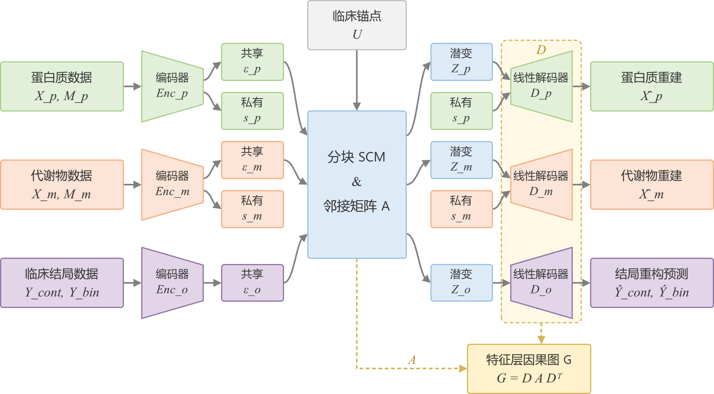

# ACLF 多模态因果 VAE 项目说明


本项目用于构建 ACLF/肝衰竭相关的多模态因果 VAE 模型，整合临床锚定变量、临床结局、蛋白组学和代谢组学数据，学习潜变量层因果结构，并将因果图投影到特征层，用于后续分子到临床结局的因果边分析和虚拟干预。

## 当前项目状态

当前主流程使用全特征数据：

- 样本总数：1950
- anchor 变量：11
- 连续临床结局：14
- 二分类临床结局：3
- 蛋白特征：2922
- 代谢物特征：252

数据已完成以下处理：

- 过滤 `Unnamed*` / `index` 等 CSV 过程列
- 过滤全缺失或常量 omics 特征
- 删除全缺失蛋白 `GLIPR1`
- 排除非数值 anchor `assess_date`
- 对 anchor、连续 phenotype、protein、metabolite 做 z-score 标准化
- 二分类结局转换为 `0/1` 浮点值
- 保留 NaN 作为缺失掩码来源，模型内部按 mask 计算重构损失

## 目录结构

```text
casualvae/
  src/casualvae/
    module_aclf_partial_multimodal.py   # 核心模型与训练入口
  scripts/
    preprocessing/                     # 数据增强、结构化和配置生成
    training/run_multiseed.py          # fixed-split 多 seed 训练
    analysis/analyze_multiseed.py      # 稳定性分析
    utilities/extract.py               # 辅助提取工具
  configs/
    aclf_full_multimodal_config.json
  data/
    augmented/                         # 增强后的上游数据
    structured_full/                   # 模型结构化输入
  artifacts/
    runs/                              # 单次训练结果
    multiseed/
      variable_split/                  # 旧 variable-split 实验
      fixed_split/                     # fixed-split 实验
    analysis/multiseed/                # 多 seed 稳定性分析
  docs/                                # 技术文档和图片
  tests/                               # 回归测试
  requirements.txt
```

## 主要文件作用

### `scripts/preprocessing/data_augmentation.py`

从 `data/raw/extract/` 读取原始提取结果，生成增强数据到 `data/augmented/`。

### `scripts/preprocessing/prepare_full_augmented_structured.py`

当前主数据准备脚本。它从 `data/augmented/` 读取数据，生成模型训练需要的结构化输入到 `data/structured_full/`。

输出包括：

- `anchors_structured.csv`：标准化后的临床锚定变量
- `phenotype_structured.csv`：标准化后的连续结局和二分类结局
- `protein_full_structured.csv`：标准化后的蛋白组学输入
- `metabolite_full_structured.csv`：标准化后的代谢组学输入
- `full_feature_columns.json`：蛋白和代谢物特征列名
- `data_quality_summary.json`：数据质量报告
- `preprocessing_params.json`：标准化均值和标准差

### `scripts/preprocessing/generate_full_config.py`

根据 `data/structured_full/full_feature_columns.json` 和结构化 CSV 表头生成训练配置 `configs/aclf_full_multimodal_config.json`。

它会确保：

- 配置列名与实际 CSV 一致
- 不把 `Unnamed*` / `index` 过程列写入配置
- 不把非数值 anchor 写入配置
- 不把实际 CSV 中不存在的 phenotype 写入配置

### `configs/aclf_full_multimodal_config.json`

当前全量模型训练配置，包含：

- anchor 列名
- phenotype 列名
- protein/metabolite 特征列名
- 可用性阈值
- 共享/私有潜变量维度
- 编码器隐藏层结构
- 结局外生输入模式（默认 `zero`，可选 `gaussian`）及噪声标准差

### `src/casualvae/module_aclf_partial_multimodal.py`

核心模型和训练脚本，包含：

- `PartialMultiOmicsDataset`：多模态缺失数据 Dataset
- `SharedPrivateEncoder`：蛋白/代谢物共享-私有编码器
- `OutcomeDecoder`：从 SCM 中的结局潜变量预测连续型和二分类结局
- `BlockSCM`：潜变量层结构因果模型
- `PartialAnchoredCausalVAE`：完整模型
- 预训练、联合训练、loss、early stopping
- 潜变量因果图和特征层因果图导出

### `scripts/preprocessing/prepare_augmented_structured.py`

旧版结构化脚本，主要面向旧的小特征流程。当前全特征主流程优先使用 `prepare_full_augmented_structured.py`。

### `requirements.txt`

项目 Python 依赖列表。

## 模型结构概览

模型要求 `shared_dims["outcome"]` 为正整数，缺失或非正数会报错。
结局外生输入只支持 `zero`（全零）与 `gaussian`（独立高斯噪声），真实 Y 仅用于监督损失。
SCM 统一按 `A[目标, 来源]` 求解 `(I - A) z = eps + context`。
`encoded_y`、`OutcomeEncoder`、`MixedOutcomeHead` 和无 outcome 的备用路径已移除；
`hidden_dims.outcome`、`outcome_hidden_dims` 不再是有效模型参数。

旧 checkpoint 中的 `enc_outcome.*`、`outcome_head.*` 参数不属于新模型，不能直接严格加载。
复现旧模型应使用对应历史代码；迁移旧 zero/gaussian 权重时，需显式排除这两组废弃键并严格核对剩余参数。
移除旧模块也会改变初始化消耗的随机数顺序，因此相同 seed 重新训练不保证得到历史实验的相同权重。

当前模型包含三个共享潜变量块：

```text
protein latent      -> 15 dimensions
metabolite latent   -> 15 dimensions
outcome latent      -> 3 dimensions
```

蛋白和代谢物还各有私有潜变量：

```text
protein private     -> 3 dimensions
metabolite private  -> 3 dimensions
```

因果结构在共享潜变量层学习。`outcome` 被建模为下游节点：

```text
protein / metabolite -> outcome
outcome -> protein / metabolite 被强制禁止
```

训练完成后，潜变量层因果图 `A` 会通过解码器投影到特征层：

```text
G = D @ A @ D.T
```

其中 `G_protein_to_outcome.csv` 和 `G_metabolite_to_outcome.csv` 是解释分子特征到临床结局影响的主要输出。

## 训练流程

训练分三阶段：

1. 蛋白自编码器预训练
2. 代谢物自编码器预训练
3. protein + metabolite + outcome 联合 SCM 训练

验证集比例默认是 `0.2`。训练集用于更新参数，验证集用于监控泛化表现、保存最佳模型和 early stopping。

## 常用命令

### 生成结构化全特征数据

```powershell
conda run -n casualvae_01 python scripts/preprocessing/prepare_full_augmented_structured.py
```

### 生成全量训练配置

```powershell
conda run -n casualvae_01 python scripts/preprocessing/generate_full_config.py
```

### 运行全量训练

```powershell
conda run -n casualvae_01 python src/casualvae/module_aclf_partial_multimodal.py `
  --anchors_csv data/structured_full/anchors_structured.csv `
  --phenotype_csv data/structured_full/phenotype_structured.csv `
  --protein_csv data/structured_full/protein_full_structured.csv `
  --metabolite_csv data/structured_full/metabolite_full_structured.csv `
  --config_json configs/aclf_full_multimodal_config.json `
  --out_dir artifacts/runs/run_fixed_full `
  --split_seed 42 `
  --model_seed 42 `
  --device cpu
```

如果机器有可用 CUDA，可以把 `--device cpu` 改成 `--device cuda`。

### 运行 fixed-split 5-seed 稳定性实验

项目约定使用 `casualvae_01` 环境。下面的命令固定 `split_seed=42`，只改变模型和训练随机性：

```powershell
conda run -n casualvae_01 python scripts/training/run_multiseed.py --split-seed 42 --model-seeds 42 123 456 789 2026 --device cpu
```

结果分别写入 `artifacts/multiseed/fixed_split/model_seed_<seed>/`。每次运行的
`run_summary.json` 记录 `split_seed` 和 `model_seed`，`data_split_summary.json`
额外记录每个模态训练/验证集的 patient ID，便于审计五次划分是否完全一致。

旧的 `--seed` 参数仍然兼容，并同时设置 split 和 model seed；它只应用于复现旧的
variable-split 实验，不应用于新的正式稳定性实验。

### 运行多-seed 稳定性分析

```powershell
conda run -n casualvae_01 python scripts/analysis/analyze_multiseed.py
```

分析结果位于 `artifacts/analysis/multiseed/`。旧结果写入
`variable_split_experiment/`，新结果写入 `fixed_split_experiment/`，两者的汇总比较为
`stability_comparison.csv`。如果 fixed-split 训练尚未完成，脚本会保留旧实验分析并明确跳过缺失的新实验。

### 运行 4.2 直接效应候选筛选

该步骤只读取现有 `G_protein_to_outcome.csv` 和
`G_metabolite_to_outcome.csv`，不会重新训练或修改模型结果：

```powershell
conda run -n casualvae_01 python scripts/analysis/direct_effect_screening.py `
  --primary_dir artifacts/multiseed/fixed_split/model_seed_456 `
  --replication_dirs artifacts/multiseed/variable_split/seed_456 artifacts/multiseed/variable_split/seed_789 `
  --sensitivity_dirs artifacts/multiseed/fixed_split/model_seed_789 `
  --out_dir artifacts/analysis/direct_effect_screening `
  --metabolite_dictionary artifacts/metadata/metabolite_feature_dictionary.csv `
  --top_edges_per_outcome 100
```

正式 4.2 以 `feature → Outcome` 边为分析单位，Protein 和 Metabolite 在每个
Outcome 内分别按 `abs(effect)` 排名。输出同时记录三个其他模型的同边 effect、
Outcome 内 rank、方向一致性、Top20/50/100 支持数，以及每个 Outcome 的
Spearman 和 Top-K Jaccard。该流程不再计算跨 Outcome 的 `DirectScore`，也不做
Tier 分层。

正式输出位于 `artifacts/analysis/direct_effect_screening/`：

- `outcome_specific_direct_edges.csv`：Primary 的全部带符号边、绝对效应和 Outcome 内排名。
- `outcome_specific_cross_model_comparison.csv`：四模型同边 effect/rank、方向一致性、Top-K 支持数及跨模型 rank 汇总。
- `outcome_specific_top_edges.csv`：每个 modality × Outcome 的 Primary Top-N 边，默认 Top100。
- `outcome_specific_stability_summary.csv`：Primary 与每个 replication/sensitivity 模型逐 Outcome 比较；Spearman 基于全部边的 `abs(effect)` 排名，Jaccard 为对应 Top-K 集合的交并比。
- `multi_outcome_feature_summary.csv`：Primary 中同一 feature 跨 Outcome 进入 Top20/50/100 的次数与 Outcome 列表，仅作辅助汇总。
- `direct_effect_summary.json`：输入模型角色、参数、数据规模和总体稳定性均值。

`sign_agreement_count` 只统计另外三个模型中与 Primary 同号的数量（0–3）；
`top20_support_count`、`top50_support_count` 和 `top100_support_count` 统计四个模型中
进入相同 Outcome 对应 Top-K 的模型数（全部边理论范围 0–4）。

代谢物名称会在 4.2 运行时自动从
`artifacts/metadata/metabolite_feature_dictionary.csv` 连接，无需再单独执行注释步骤；
原始 `feature_code` 仍作为唯一键保留。

## 训练输出

训练输出目录通常包含：

- `model.pt`：模型权重
- `training_history.csv`：每个 epoch 的训练和验证指标
- `run_summary.json`：样本数、特征数、潜变量维度摘要
- `data_split_summary.json`：训练/验证样本划分摘要
- `latent_causal_A.csv`：潜变量层因果邻接矩阵
- `decoder_projection_D.csv`：解码器投影矩阵
- `feature_projection_G.csv`：完整特征层因果图
- `G_protein_to_outcome.csv`：蛋白到结局的因果边
- `G_metabolite_to_outcome.csv`：代谢物到结局的因果边
- `top_edges_protein_to_outcome.csv`：蛋白到结局 top 边
- `top_edges_metabolite_to_outcome.csv`：代谢物到结局 top 边
- `phenotype_cont_pred.csv`：连续结局预测
- `phenotype_bin_pred_prob.csv`：二分类结局预测概率
- `shared_latent_z.csv`：样本级共享潜变量
- `sample_availability.csv`：样本模态可用性

## 当前数据注意事项

- 联合训练真正依赖 protein 和 metabolite 都可用的 paired 样本，目前 paired 可用样本数记录在 `data_quality_summary.json`。
- 当前数据已经标准化，因此训练 loss 数值会比未标准化版本更可比较。
- 如果需要把预测值或效应解释回原始临床量纲，应使用 `preprocessing_params.json` 中的均值和标准差。
- 当前结果目录如 `artifacts/runs/run_fixed_full/` 是训练产物，不是源数据；重跑训练时应使用新的输出目录，避免覆盖重要结果。
